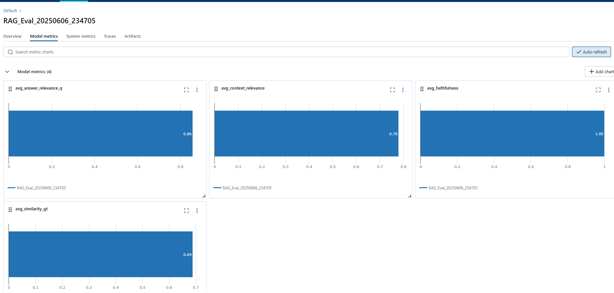

# RAG on News Articles

This project implements a RAG (Retrieval Augmented Generation) system with a FastAPI backend and a React frontend.

## Prerequisites

*   Python 3.7+
*   Node.js and npm (or yarn)

## Backend Setup (FastAPI)

1.  **Navigate to the project directory:**
    ```bash
    cd RAG_on_news_Articles
    ```

2.  **Create and activate a virtual environment (recommended):**
    ```bash
    python -m venv venv
    # On Windows
    venv\Scripts\activate
    # On macOS/Linux
    source venv/bin/activate
    ```

3.  **Set up Environment Variables (e.g., Google API Key):**
    It's recommended to use a `.env` file to manage your environment variables.
    *   Create a file named `.env` in the `RAG_on_news_Articles` root directory (alongside `main.py`).
    *   Add your Google API key to this file:
        ```env
        GOOGLE_API_KEY="your_actual_google_api_key_here"
        # Add other environment variables if needed, e.g.:
        # ANOTHER_API_KEY="your_other_key"
        ```
    *   **Important:** Add `.env` to your `.gitignore` file to prevent committing your secret keys to version control. If you don't have a `.gitignore` file, create one in the `RAG_on_news_Articles` root and add `.env` to it.
        ```
        # .gitignore
        .env
        venv/
        __pycache__/
        *.pyc
        *.pyo
        *.pyd
        # Add other files/directories to ignore

4.  **Install Python dependencies:**
    ```bash
    pip install -r requirements.txt
    ```
  

## Frontend Setup (React)

1.  **Navigate to the frontend directory:**
    From the `RAG_on_news_Articles` directory:
    ```bash
    cd static_frontend
    ```

2.  **Install Node.js dependencies:**
    ```bash
    npm install
    ```
    This will install React, `axios`, and other necessary packages defined in `static_frontend/package.json`.

## Running the Application

1.  **Build the React frontend:**
    *   Make sure you are in the `static_frontend` directory.
    *   Run the build command:
        ```bash
        npm run build
        ```
        This will create/update the `static_frontend/build` directory.

2.  **Run the FastAPI Backend:**
    *   Navigate back to the main project directory (`RAG_on_news_Articles`).
    *   Ensure your Python virtual environment is activated.
    *   Start the FastAPI server:
        ```bash
        python main.py
        ```
    You should see output indicating the server is running, typically on `http://localhost:8000`.

3.  **Access the Application:**
    Open your web browser and go to:
    [http://localhost:8000](http://localhost:8000)

## Development Workflow

*   **Backend Changes:** If you modify the Python code (`main.py` or service files), you'll generally need to stop (Ctrl+C) and restart the `python main.py` server.
*   **Frontend Changes:**
    *   If you're actively developing the frontend, you can run the React development server for hot reloading:
        ```bash
        cd static_frontend
        npm start # Or npm run dev if you used Vite
        ```
        This usually runs on `http://localhost:3000` (or another port). You'd make API calls to your FastAPI backend running on `http://localhost:8000`. Remember that your FastAPI `CORSMiddleware` is set up to allow this.
    *   When you're ready to deploy or use the integrated version, remember to run `npm run build` in `static_frontend` so `main.py` serves the latest frontend code.

## API Endpoint

The main API endpoint used by the frontend is:

*   `POST /api/rag_query/`
    *   Request body (JSON):
        ```json
        {
          "question": "Your query string here"
        }
        ```
    *   Response body (JSON):
        ```json
        {
          "context": "...",
          "response": "...",
          "evaluation_metrics": {
            "context_relevance": 0.0,
            "context_relevance_reasoning": "...",
            "faithfulness": 0.0,
            "faithfulness_reasoning": "...",
            "answer_relevance_q": 0.0,
            "answer_relevance_q_reasoning": "..."
          }
        }
        ```

## Gathering Dataset

-   Sourced from: [https://www.kaggle.com/datasets/jacopoferretti/bbc-articles-dataset/data](https://www.kaggle.com/datasets/jacopoferretti/bbc-articles-dataset/data)
-   Questions in this dataset were categorized under five categories: business, entertainment, politics, sport, and tech.
-   A total of 400 questions (80 from each of the 5 categories mentioned earlier) were sampled.
-   Files available in: `datafiles/source_data`

## Chunking and Embedding Dataset

**Notebook:** `notebooks/Embed_RAG_Docs.ipynb`

### Model used for embedding documents
-   **Model name:** "models/text-embedding-004" by Google
-   **Task type:** `RETRIEVAL_DOCUMENT`

### Vector DB used
-   ChromaDB

### Steps followed
-   Initialize embeddings model.
-   Chunk documents using `RecursiveCharacterTextSplitter` from Langchain with a chunk size of 1000.
-   Create ChromaDB vector store and store embeddings created on the document chunks.

## Generating Synthetic Dataset for Evaluation

**Notebook:** `notebooks/Generate_synthetic_test_dataset.ipynb`

### Models Used
-   **For Question Generation:** `gemini-2.5-flash-preview-05-20`
-   **For Critiquing Generated Questions:** `gemini-2.0-flash`

### Steps Followed
-   Chunk the sampled dataset (mentioned earlier) using `RecursiveCharacterTextSplitter` with a chunk size of 2000.
-   Generate Question-Answer tuples from 300 randomly sampled document chunks using a prompt template and the `gemini-2.5-flash-preview-05-20` model, resulting in a total of 300 questions.
-   Critique generated Question-Answer pairs based on two metrics:
    -   **`question_groundedness`**: How well one can answer the given question unambiguously with the given context (rating 1-5).
    -   **`question_standalone`**: How context-independent the question is (rating 1-5).
-   Filter questions by selecting those with a `groundedness_score` of 5 and a `standalone_score` of 5, resulting in 269 questions.

## Generating Answers for Evaluation

**Notebook:** `notebooks/generate_answers_RAG.ipynb`

### Models Used
-   **For Embedding Questions/Queries:**
    -   **Model name:** "models/text-embedding-004" by Google
    -   **Task type:** `RETRIEVAL_QUERY`
-   **For Answer Generation:** `gemini-1.5-flash`

### Steps Followed
-   Load ChromaDB vector store.
-   Embed questions from the previously generated evaluation dataset using "models/text-embedding-004" by Google.
-   Query the vector store to retrieve context.
-   Use the context and question text, plug them into a prompt template, and generate answers using the `gemini-1.5-flash` model.

## Evaluation Metrics for RAG

**Model used for LLM-as-a-judge evaluation:** `gemini-2.0-flash`

-   **`context_relevance`**: Assesses the relevance of the provided context for answering a given question.
    -   **Inputs:** question, retrieved context
    -   **Outputs:** reasoning, score (0 to 1)
-   **`faithfulness`**: Assesses the faithfulness of a generated answer to its provided context. An answer is faithful if all claims made in the answer are supported by the information present in the retrieved context.
    -   **Inputs:** question, retrieved context, generated answer
    -   **Outputs:** reasoning, score (0 to 1)
-   **`answer_relevance_q`**: Assesses how relevant and complete a generated answer is with respect to the user's question.
    -   **Inputs:** question, generated answer
    -   **Outputs:** reasoning, score (0 to 1)
-   **`correctness`**: Assesses the factual correctness and completeness of a Generated Answer by comparing it against a Ground Truth Answer.
    -   **Inputs:** question, generated answer, ground truth answer
    -   **Outputs:** reasoning, score (0 to 1)

## MLFlow UI Dashboard for offline evaluation

**Notebook:** `notebooks/evaluate_RAG.ipynb`

### Steps Followed
-   For the answers generated earlier, run them through the evaluation metrics listed previously. These metrics should be wrapped with an MLflow decorator as shown in the aforementioned notebook.
-   Run MLflow from the command line:
    ```bash
    mlflow ui
    ```
-   Open `http://localhost:5000` in your browser to see the model evaluations dashboard, click on the topmost experiment titled "RAG_Eval_20250606_234705"( run for the evaluation dataset mentioned above) to see corresponding metrics and traces.


- Then in dashboard, click on Model metrics tab to see average metrics score



- For seeing all metrics traces, navigate to traces tab to see all evaluation responses generated for each of the questions.


- Click on one of the request_id to see all the corresponding traces, of request and response:


-   The "Traces" tab in the dashboard contains question-by-question evaluations.

## Online evaluation and Interface
- From the root directory, run:
 ```bash
 python main.py
 ```
 - Now in browser, open : http://localhost:8000/
 Interface will look like this:


- After entering question in provided textbox , and hitting submit query, results will look like this:


